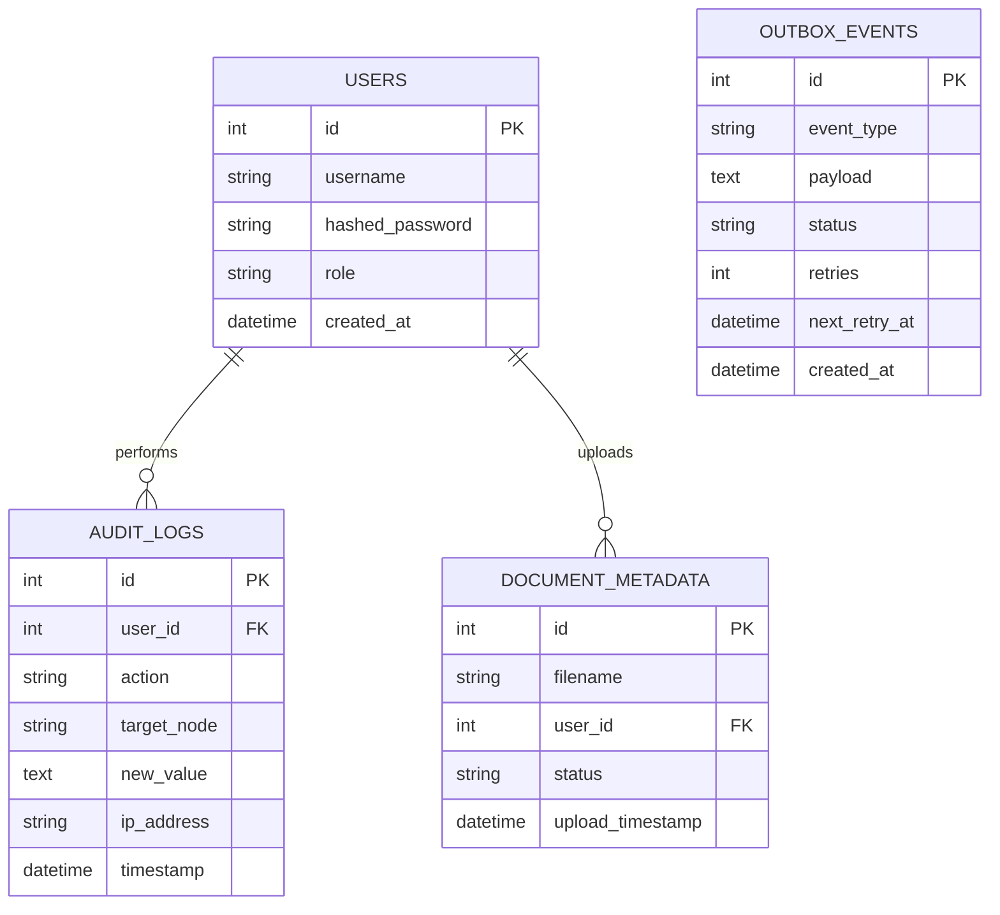
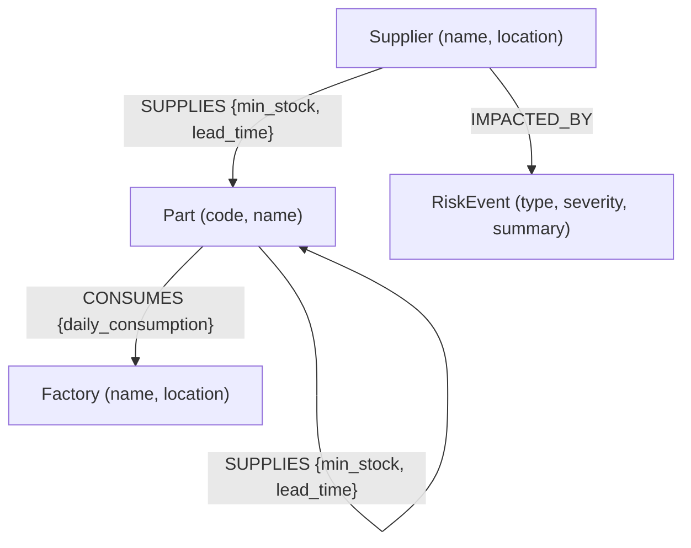

# N-Tier Architecture & Logic

This document details the core mathematical models, architectural patterns, and decision-making logic used in the N-Tier Supply Chain Intelligence platform.

## 1. Risk Engine: Simulation Logic

The Risk Engine uses recursive Neo4j traversal to project how a failure at a Tier-N supplier cascades upwards to final assembly factories.

### Bottleneck Calculation Formula
A relationship is flagged as a **Weak Link** or **Bottleneck** if the following condition is met:

$$ \text{Stock Coverage (Days)} = \frac{\text{Minimum Stock Units}}{\text{Daily Consumption}} $$

A relationship is at risk if:
1. `Stock Coverage < Crisis Duration`
2. `Stock Coverage < Lead Time Days`

### Recursive Traversal
The simulation travels from the impacted supplier `(s:Supplier)` along the `[:SUPPLIES*]` path up to `settings.risk_simulation_depth`. 
- **Impacted Factories**: Any `(f:Factory)` connected to a `(p:Part)` reached by the traversal is marked as impacted.
- **Cascading Depth**: The total number of tiers affected between the supplier and the factory.

---

## 2. Entity Resolution: Fuzzy Mapping

To maintain graph integrity, the system must resolve supplier names (e.g., "Siemens AG" vs "Siemens") to a single node.

### Rationale for Threshold (50.0)
The resolution service uses Neo4j's Full-Text Search (Lucene-based BM25).
- **BM25 Scoring**: Unlike simple Levenshtein distance, BM25 factors in term frequency and importance.
- **Why 50.0?**: Standard BM25 scores vary, but empirical testing showed that for supplier names, a normalized score of 50 capture significant overlaps (typos, abbreviations) while avoiding false positives for distinct entities with similar words (e.g., "Global Logistics" vs "Global Electronics").

---

## 3. Database Schema

### PostgreSQL (Transactional & Operations)

### Neo4j (Knowledge Graph Model)

